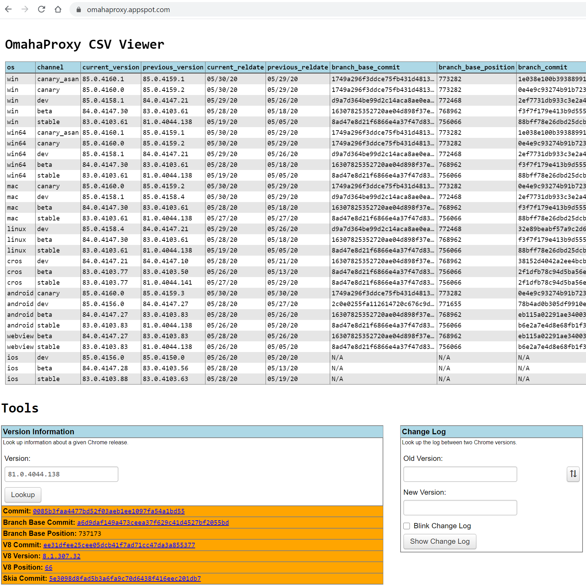

1. browse win64 stable versions:
   https://omahaproxy.appspot.com/

1. use Position Lookup (under Tools)

   # to obtain the Branch Base Position

   

1. obtain the corresponding Win_x64 versions (e.g. 81.0.4044.138 -> 737173)
   https://commondatastorage.googleapis.com/chromium-browser-snapshots/index.html

1. get the download link for `chrome-win.zip`, e.g.
   `https://www.googleapis.com/download/storage/v1/b/chromium-browser-snapshots/o/Win_x64%2F737173%2Fchrome-win.zip?generation=1580439619624464&alt=media`

1. get the download link for `chromedriver_win32.zip`, e.g.
   `https://www.googleapis.com/download/storage/v1/b/chromium-browser-snapshots/o/Win_x64%2F737173%2Fchromedriver_win32.zip?generation=1580439625877582&alt=media`

   1. update [DockerFile](DockerFile) using the links above

   1. update [Build.ps1](Build.ps1) to tag your chosen version (e.g. 737173), if desired